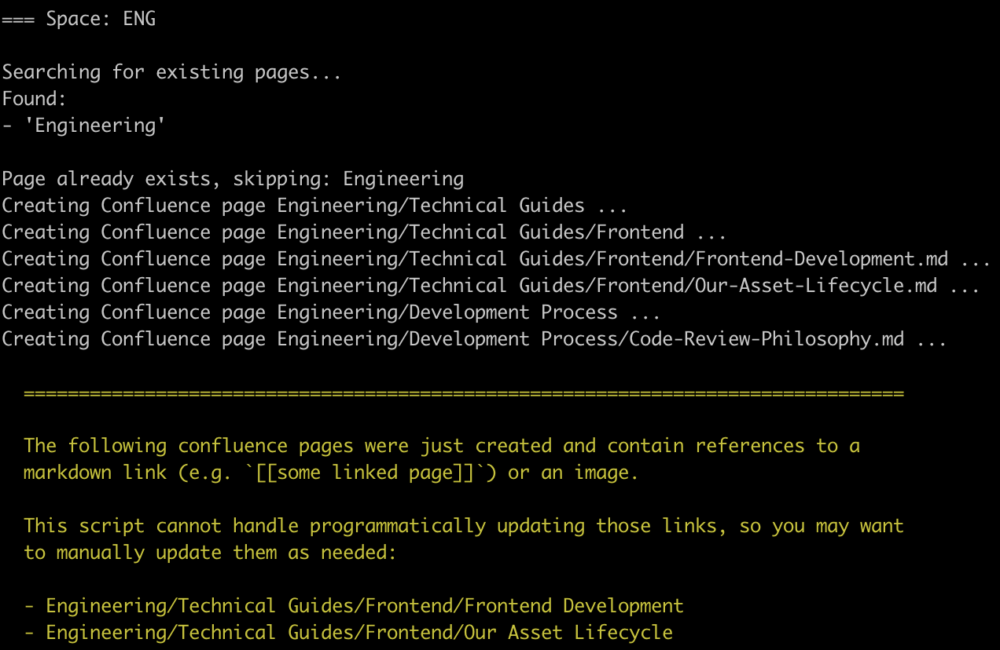

# Wiki Migrate

Blindly mass copies the contents of a Github repository Wiki to a Confluence Space.

<p>
  
</p>

### Notes

* A `.yml` config file specifies what pages are copied over and how they are organized
* The [Confluence REST API](https://developer.atlassian.com/server/confluence/confluence-rest-api-examples/) is used to programmatically create new pages.
* Github Markdown is converted to HTML using the [Kramdown gem](https://github.com/gettalong/kramdown).

This script does **not** perform any destructive actions like `DELETE` or `UPDATE`. It can be safely re-run multiple times.

This script does not handle converting Github markdown links (e.g. `[[some page link]]`), but it will let you know which pages contain them so you can manually update them.

# Quick Start

Create a `config.yml` file that maps Github wiki filenames to a new Confluence heirarchy structure

```yaml
data:
  "ENG":

    # Most spaces have a default/root page that all pages are nested under.
    # Be sure to include that when specifying this heirarchy
    "Engineering":

      "Development Process":
        - Code-Review-Philosophy.md

      "Technical Guides":
        "Frontend":
          - Our-Asset-Lifecycle.md
          - Frontend-Development.md
```

Specify the environment

```
cp .env.sample .env
vi .env

# Fill out `.env` file values
```

Bundle install

```
bundle install
```

Run

```
bin/wiki-migrate
```
